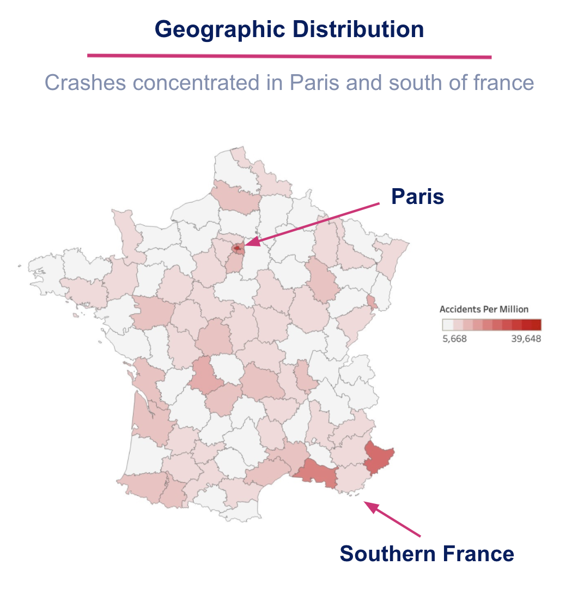
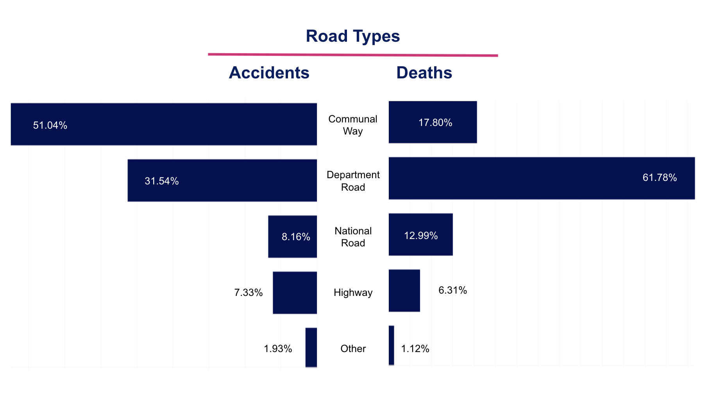
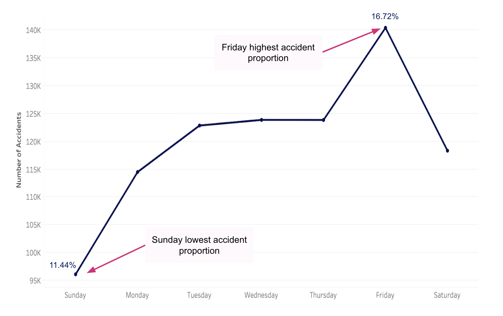
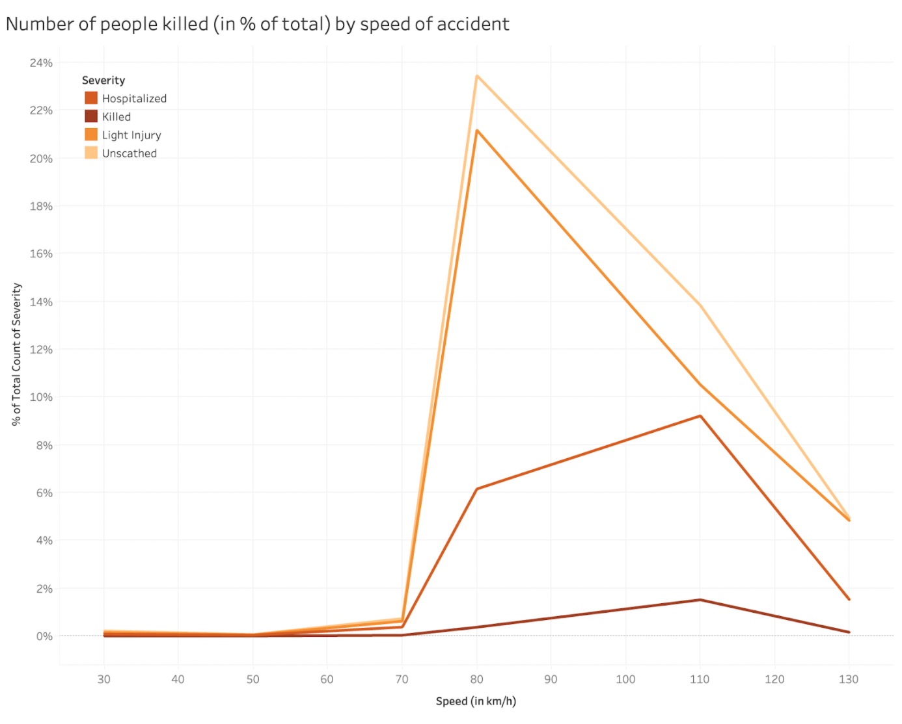
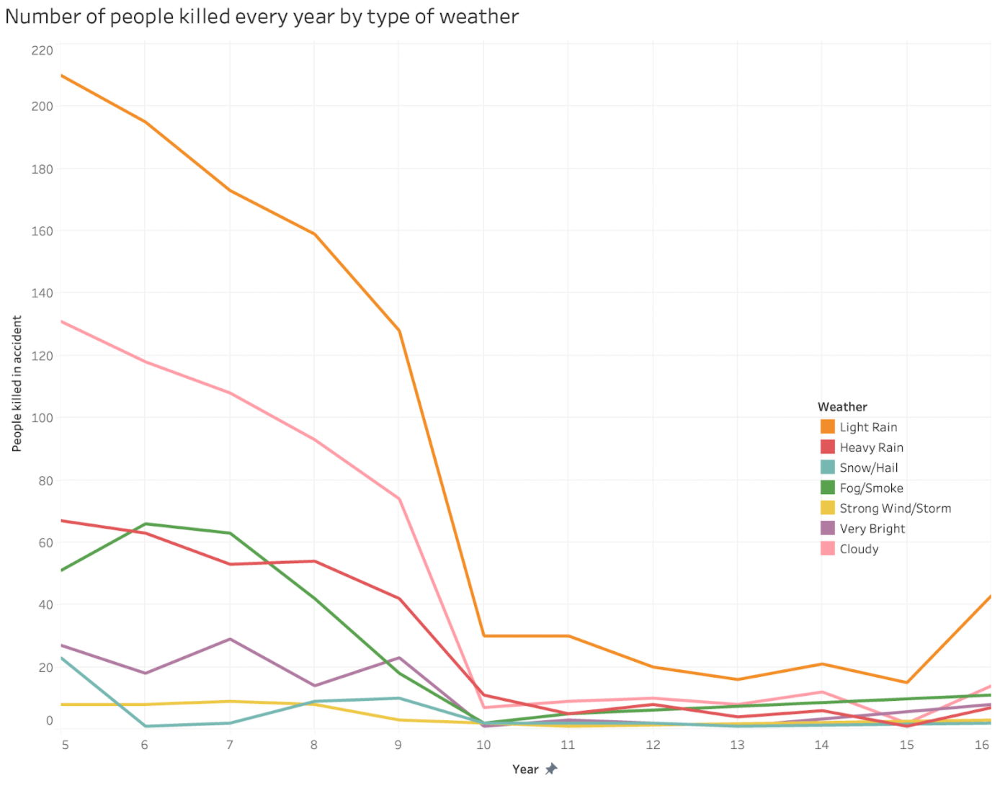

```{r setup, include=FALSE}
knitr::opts_chunk$set(echo = TRUE)
```

```{r, warning = FALSE, message =FALSE, include = FALSE}
library(tidyverse)
library(lubridate)
library(janitor)
library(vroom)
library(skimr)
library(sf)
library(dplyr)
library(plyr)
library(ggplot2)
library(glmnet)
```

# Introduction

We obtained our data from Kaggle, which is a virtual repository with thousands of real-world data sets available for free and chose to inspect data pertaining to road accidents in France between the years of 2005 and 2016.

The data came in the form of five separate files: file one contained information about the actual incident of the accident; file two pertained to the location of the accident; file 3 pertained to the individuals involved in the accident; file 4 pertained to the vehicles involved in the accidents; and file 5 contained all the holidays observed in France and their corresponding dates.

We joined all of these tables and eliminated uninformative or NA columns before renaming some columns to more logical names and changing the class of certain factor variables. 


# Data Cleaning

## Column Names Translation

First for data cleaning, we cleaned column names and translated column names that were labeled in French to English.

```{r message=FALSE, warning=FALSE}
accidents <- read_csv(here::here("data", "caracteristics.csv")) %>%
  janitor::clean_names() %>%
  dplyr::rename(acc_id = num_acc,
                day = jour,
                month = mois,
                year = an,
                time = hrmn,
                light = lum,
                weather = atm)

holidays <- read_csv(here::here("data", "holidays.csv")) %>%
  janitor::clean_names() %>%
  dplyr::rename(date = ds)

location <- read_csv(here::here("data", "places.csv")) %>%
  janitor::clean_names() %>%
  dplyr::rename(acc_id = num_acc,
                road_type = catr,
                road_nr = voie,
                traffic_flow = circ,
                lane_nr = nbv,
                bike_lane = vosp,
                road_steep = prof,
                surface = surf,
                road_loc = infra,
                accident_loc = situ,
                near_school = env1)

persons <- read_csv(here::here("data", "users.csv")) %>%
  janitor::clean_names() %>%
  dplyr::rename(acc_id = num_acc,
                veh_id = num_veh,
                person_loc = place,
                person_role = catu,
                severity = grav,
                gender = sexe,
                dob = an_nais,
                trip_goal = trajet,
                safety_equip = secu,
                ped_loc = locp,
                ped_action = actp,
                ped_accomp = etatp)

vehicles <- read_csv(here::here("data", "vehicles.csv")) %>%
  janitor::clean_names() %>%
  dplyr::rename(acc_id = num_acc,
                veh_id = num_veh,
                vehicle_type = catv)
```

## Raw Data

Here, we merged dataframes by accident_id to make sure we get all information regarding every accident.

```{r message=FALSE, warning=FALSE}
# Join the data frames that do not have to be formatted first
accidents1 <- accidents %>% 
  left_join(location, by="acc_id") 
accidents2 <- accidents1 %>% 
  left_join(persons, by="acc_id") 
accidents3 <- accidents2 %>% 
  left_join(vehicles, by=c("acc_id", "veh_id")) 

glimpse(accidents3)

```

## Technically Correct Data

To create technically correct data, we made sure that:

* Values can be directly recognized as belonging to a certain variable

* Values are stored in a data type that represents the value domain of the real-world variable

* Text variable should be stored as text, numeric variable as a number and etc

For Date variables, we changed all date columns to date format in R:

```{r message=FALSE, warning=FALSE}
# Format holidays data frame 
date_1 <- format(holidays$date, format="%m-%d")
holidays <- cbind(holidays, date_1)
holidays <- subset(holidays, select = c(holiday, date_1))
holidays <- holidays %>% distinct(date_1, .keep_all = TRUE)

# Create double digit values for all single digit month and date values
accidents3$month[accidents3$month == "1"] <- "01"
accidents3$month[accidents3$month == "2"] <- "02"
accidents3$month[accidents3$month == "3"] <- "03"
accidents3$month[accidents3$month == "4"] <- "04"
accidents3$month[accidents3$month == "5"] <- "05"
accidents3$month[accidents3$month == "6"] <- "06"
accidents3$month[accidents3$month == "7"] <- "07"
accidents3$month[accidents3$month == "8"] <- "08"
accidents3$month[accidents3$month == "9"] <- "09"

accidents3$day[accidents3$day == "1"] <- "01"
accidents3$day[accidents3$day == "2"] <- "02"
accidents3$day[accidents3$day == "3"] <- "03"
accidents3$day[accidents3$day == "4"] <- "04"
accidents3$day[accidents3$day == "5"] <- "05"
accidents3$day[accidents3$day == "6"] <- "06"
accidents3$day[accidents3$day == "7"] <- "07"
accidents3$day[accidents3$day == "8"] <- "08"
accidents3$day[accidents3$day == "9"] <- "09"

date_1 <- paste(accidents3$month, accidents3$day, sep = "-")
accidents3 <- cbind(accidents3, date_1)
```

For Factor variables, we changed columns that represented factor variables to factor format:

```{r}
# Drop unnecessary columns and filter data to only include rows corresponding to a driver
accidents3 <- subset(accidents3, select = -c(gps, lat, long, dep, v1, v2, pr, pr1, senc, occutc))

# Create speed variable using highly correalated variable (road_type)
accidents3$speed[accidents3$road_type == "1"] <- "130"
accidents3$speed[accidents3$road_type == "2"] <- "110"
accidents3$speed[accidents3$road_type == "3"] <- "110"
accidents3$speed[accidents3$road_type == "4"] <- "80"
accidents3$speed[accidents3$road_type == "5"] <- "50"
accidents3$speed[accidents3$road_type == "6"] <- "30"
accidents3$speed[accidents3$road_type == "9"] <- "70"

# Create outcome variable
accidents3$outcome[accidents3$severity == "1"] <- "Not Killed"
accidents3$outcome[accidents3$severity == "3"] <- "Not Killed"
accidents3$outcome[accidents3$severity == "4"] <- "Not Killed"
accidents3$outcome[accidents3$severity == "2"] <- "Killed"


# Join holidays data frame with collective data frame
accidents6 <- accidents3 %>% 
  left_join(holidays, by= "date_1")

# Remove rows which contain NA values as glmnet cannot deal with NA values and drop columns unnecessary for Ridge computation
accidents8 <- accidents6[!is.na(accidents6$severity),]
accidents8 <- subset(accidents8, select = -c(adr, date_1, acc_id))
accidents8$holiday[is.na(accidents8$holiday)] <- "No Holiday"
accidents8 <- na.omit(accidents8)

# Convert day and month columns from character to numeric arguments
accidents8$day <- as.factor(accidents8$day)
accidents8$month <- as.factor(accidents8$month)
accidents8$speed <- as.numeric(accidents8$speed)
accidents8$year <- as.factor(accidents8$year)
accidents8$light <- as.factor(accidents8$light)
accidents8$agg <- as.factor(accidents8$agg)
accidents8$int <- as.factor(accidents8$int)
accidents8$weather <- as.factor(accidents8$weather)
accidents8$col <- as.factor(accidents8$col)
accidents8$road_type <- as.factor(accidents8$road_type)
accidents8$traffic_flow <- as.factor(accidents8$traffic_flow)
accidents8$lane_nr <- as.factor(accidents8$lane_nr)
accidents8$bike_lane <- as.factor(accidents8$bike_lane)
accidents8$road_steep <- as.factor(accidents8$road_steep)
accidents8$plan <- as.factor(accidents8$plan)
accidents8$surface <- as.factor(accidents8$surface)
accidents8$road_loc <- as.factor(accidents8$road_loc)
accidents8$accident_loc <- as.factor(accidents8$accident_loc)
accidents8$person_loc <- as.factor(accidents8$person_loc)
accidents8$person_role <- as.factor(accidents8$person_role)
accidents8$gender <- as.factor(accidents8$gender)
accidents8$trip_goal <- as.factor(accidents8$trip_goal)
accidents8$ped_loc <- as.factor(accidents8$ped_loc)
accidents8$ped_action <- as.factor(accidents8$ped_action)
accidents8$ped_accomp <- as.factor(accidents8$ped_accomp)
accidents8$vehicle_type <- as.factor(accidents8$vehicle_type)
accidents8$obs <- as.factor(accidents8$obs)
accidents8$obsm <- as.factor(accidents8$obsm)
accidents8$choc <- as.factor(accidents8$choc)
accidents8$manv <- as.factor(accidents8$manv)

# Drop severity column as this has been replaced by 'outcome'
accidents8 <- subset(accidents8, select = -severity)

```


# Data Visualization

## Geographic Visualization

We used a geographic visualization to see the ditribution of accidents in different departments in France.



As we can see from the map, it is expected that Paris being the capital city of France, has the highest accidents per million population. Other than Paris, Southern France showed higher accidents per million population compared to the rest of the country.

## Impact of Road Type

We investigated on on Road Type where accidents happened and compare that with Road Type where fatal accidents happened.

```{r message=FALSE, warning=FALSE}
library(dplyr)
library(tidyverse)

accidents_plot <- accidents %>%
  merge(persons, by = "acc_id") %>% 
  merge(location, by = "acc_id")

killed <- accidents_plot %>% 
  filter(severity == 2)

# Plot accidents by road_type
#accidents_plot %>% 
#  drop_na(road_type) %>% 
#  dplyr::count(road_type) %>% 
#  mutate(road_type = factor(road_type, levels = c("1","2","3","4","5","6","9"))) %>% 
#  mutate(perc = n/sum(n)*100) %>% 
#  filter(road_type == "1" | road_type == "2" | road_type == "3" | road_type == "4") %>% 
#  ggplot(aes(x = road_type, y = perc)) +
#    geom_col() +
#    labs(title = "All Accidents by Road Type")
  
# Plot fatal accidents by road_type
#killed %>% 
#  dplyr::count(road_type) %>% 
#  mutate(road_type = factor(road_type, levels = c("1","2","3","4","5","6","9"))) %>% 
#  mutate(perc = n/sum(n)*100) %>% 
#  filter(road_type == "1" | road_type == "2" | road_type == "3" | road_type == "4") %>% 
#  ggplot(aes(x = road_type, y = perc)) +
#    geom_col() +
#    labs(title = "All Accidents with death by Road Type")
```



As we can see from the plot, most accidents happen on the communal ways but most fatal accidents happen on department roads. This can be because accidents in department roads tend to involve vehicles driving in higher speed.

## Car crashes by day of week

Next, we will investigate on which day of week has the highest percentage of accidents.

```{r}
age_accidents <- accidents3 %>%
  mutate(age = 2021-dob,
         year = 2000 + year,
         date = as.Date(paste(year,month,day, sep = "-"), "%Y-%m-%d"))
#write_csv(age_accidents, "data/age_accidents.csv")
```



As we can see, Friday has the highest proportion of accidents, with a percentage of 16.72%, while Sunday has the lowest proportion of accidents, with a percentage of 11.44%. This can be because there are generally more commutes on weekdays due to the need to go to work and less commutes on weekends. On Friday, people might even commute after work for leisure activities, leading to even higher proportion of accidents.

## Heat Maps

We will use heat maps to investigate accident occurrences based on multiple variables.

```{r message=FALSE, warning=FALSE}
accidents_graph <- accidents3 %>% 
  mutate(age = year + 2000 - dob)

#head(accidents_graph)

accidents_graph$acc_id<-format(accidents_graph$acc_id, scientific = FALSE)
#head(accidents_graph)

#table(accidents_graph$near_school)

#class(accidents_graph$near_school)
accidents_graph$near_school<-as.factor(accidents_graph$near_school)

accidents_graph <- accidents_graph %>% 
  filter(int != 0) %>% 
  mutate(int = case_when(int == 1 ~ "Out of intersection", int == 2 ~ "X intersection", 
                         int == 3 ~ "T intersection", int == 4 ~ "Y intersection",
                         int == 5 ~ "More than 4 branches intersection", int == 6 ~ "Giratory",
                         int == 7 ~ "Place",int == 8  ~ "Level crossing",int == 9 ~ "Other"))

accidents_graph <- accidents_graph %>% 
  filter(surface != 0) %>% 
  mutate(surface = case_when(surface ==1  ~ "normal", surface == 2 ~ "wet", surface == 3 ~ "puddles", 
                             surface == 4 ~ "flooded",surface == 5 ~ "snow",surface == 6 ~ "mud",
                             surface == 7 ~ "icy",surface == 8  ~ "fat-oil",surface == 9 ~ "other"))


accidents_graph <- accidents_graph %>% 
  mutate(road_type = case_when(road_type ==1  ~ "Highway", road_type == 2 ~ "National Road", 
                               road_type == 3 ~ "Departmental Road", road_type == 4 ~ "Communal Way",
                               road_type == 5 ~ "Off-Public Network",road_type == 6 ~ "Parking Lot",
                               road_type == 9 ~ "other"))

table_int_sur <- table(accidents_graph$int,accidents_graph$surface)
addmargins(table_int_sur)

matrix_int_sur <- as.matrix(table_int_sur)
for (i in 1:nrow(matrix_int_sur)){
        for (j in 1:ncol(matrix_int_sur)){
                matrix_int_sur[i,j] <- log(matrix_int_sur[i,j])
        }
}
heatmap(matrix_int_sur, Rowv=NA, Colv=NA, scale="none", margins=c(5,3), 
        cm.colors(256,start=02,end=0.5), cexRow=0.8, cexCol=0.9)

library(RColorBrewer)
legend(y=0.3, x=-0.01, legend=c("min", "avg", "max"), 
       fill=colorRampPalette(brewer.pal(8, "Oranges"))(3))

```

Accidents are most frequent in "out of intersection" at both "normal" and "wet" day condition.

```{r message=FALSE, warning=FALSE}
library(stats)
table_road_sur <- table(accidents_graph$road_type,accidents_graph$surface)
addmargins(table_road_sur)

matrix_road_sur <- as.matrix(table_road_sur)
for (i in 1:nrow(matrix_road_sur)){
        for (j in 1:ncol(matrix_road_sur)){
                matrix_road_sur[i,j] <- log(matrix_road_sur[i,j])
        }
}
heatmap(matrix_road_sur, Rowv=NA, Colv=NA, scale="none", margins=c(5,3),
        cm.colors(256,start=02,end=0.5), cexRow=0.8, cexCol=0.9)
```

As for the type of road, national road and communal way had the most accidents.

## Frequency of accidents by year

We will investigate the frequency of accidents that happened in France by year.

```{r message=FALSE, warning=FALSE}
library(RColorBrewer)

accidents_graph <- accidents_graph %>% 
  mutate(gender = if_else(gender == 1, "Male", "Female"),
         year = 2000 + year) 

accidents_graph %>% 
  dplyr::count(year) %>% 
  ggplot(aes(x= year,  y=n)) +
  geom_bar(position = "dodge", stat = "identity", fill = "#ece7f2") +
  labs(title = "The frequency of accidents decreased from 2005 to 2016",
       x= "Year",
       y = "Number of accidents") +
  geom_text(aes(label=n), size=3, position=position_dodge(width=0.2), vjust=-0.25) +
  theme(panel.grid = element_blank(),
        panel.border = element_blank(),
        panel.background = element_blank(),
        axis.line = element_line(size=0.3, color="black")) +
  theme(text = element_text(size =10, family = "Times New Roman")) +
  theme(axis.title.x = element_text(margin = margin(t = 10, r = 0, b = 0, l = 0))) +
  theme(axis.title.y = element_text(margin = margin(t = 0, r = 12, b = 0, l = 0))) +
  theme(plot.title = element_text(margin = margin(t = 0, r = 0, b = 16, l = 0)))


```

As we can see from the above plot, there has been a consistent drop in frequency of accidents from 2005 to 2016. This indicates that the roads in France are getting safer in general.

## Age of drivers

```{r,warning=FALSE}
accidentsDriverAge <- accidents_graph %>% 
  filter(person_role ==1) %>% 
  filter(!is.na(year) && !is.na(dob)) %>% 
  mutate(age= year - dob) %>% 
  filter(!is.na(age)) %>% 
  mutate(age = case_when( age <=20 ~ 'Under 20', 
                          age > 20  & age <= 40 ~ '20-40',
                          age > 40  & age <= 60 ~ '40-60',
                          age >= 60 ~ 'Over 60')) 
accidentsDriverAge$age <- factor(accidentsDriverAge$age, levels = c("Under 20", "20-40", "40-60", "Over 60"))
label2 <- "20-40 year olds \n account for 50% of \n the total accidents"

my_colours<-c("grey80", "tomato")
e <- accidentsDriverAge %>% 
  dplyr::count(age)

e %>% 
  ggplot(aes(x= age,  y=n/1000, fill=factor(ifelse(age=="20-40","Highlighted","Normal")))) +
  theme(legend.position = "none") +
  geom_bar(position = "dodge", stat = "identity", 
           fill=factor(ifelse(e$age=="20-40", "#dd1c77", "#ece7f2"))) +
  labs(colour = "20-40",
       title = "Age of Drivers is Related to the Number of Accidents",
       x= "Age of the Driver",
       y ="Number of accidents (in thousands)")+
  
  #add a curve to draw attention to a value
  geom_curve(
    data = data.frame(x = 1, y = 200, xend = 2.1, yend = 500),
    mapping = aes(x = x, y = y, xend = xend, yend = yend),
    colour = "grey15",
    size = 0.5,
    curvature = -0.25,
    arrow = arrow(length = unit(2, "mm"), type = "closed"),
    inherit.aes = FALSE
  ) +
  #add the text label on the graph
  geom_text(
    data = data.frame(x = 1, y = 450, label = label2),
    aes(x = x, y = y, label = label),
    colour="#a6bddb",
    family="Lato",
    hjust = 0.5,
    lineheight = .8,
    inherit.aes = FALSE,
  ) +
  theme(panel.grid = element_blank(),
        panel.border = element_blank(),
        panel.background = element_blank(),
        axis.line=element_line(size=0.3,color="black"))+
  theme(text = element_text(size = 10, family = "Times New Roman")) +
  theme(axis.title.x = element_text(margin = margin(t = 10, r = 0, b = 0, l = 0))) +
  theme(axis.title.y = element_text(margin = margin(t = 0, r = 12, b = 0, l = 0))) +
  theme(plot.title = element_text(margin = margin(t = 0, r = 0, b = 16, l = 0)))

```

From the plot above, we can observe that drivers involved in accidents are mostly aged between 20 - 40 years old. This age range accounts for almost 50% of all accidents. This makes sense as we expect this age range to be the age of most drivers on the road.

# Model Building

## Ridge Regression model

We were interested in the question "What are the important factors that affect the severity of an accident?". With this, we built a Ridge Regression model that predicts the probability of an accident of being fatal with other variables such as speed, weather, etc.

```{r}
# Declare x and y variables
x_vars <- model.matrix(outcome~. , accidents8)[,-1]
y_var <- accidents8$outcome

# Splitting the data into test and train
set.seed(10086)
train = sample(1:nrow(x_vars), nrow(x_vars)/2)
x_test = (-train)
y_test = y_var[x_test]
 
# Fitting cross validation
cv_output <- cv.glmnet(x_vars[train,], y_var[train],
                       alpha = 0, #lambda = lambda_seq, 
                       nfolds = 5, family = "binomial", type.measure = "class")
 
# Identifying best lambda
best_lam <- cv_output$lambda.min
best_lam

# Use best lambda to construct best lasso model and execute prediction on testing set
ridge_best <- glmnet(x_vars[train,], y_var[train], alpha = 0, lambda = best_lam)
pred <- predict(ridge_best, s = best_lam, newx = x_vars[x_test,])

# Obtain coefficients of ridge regression
coef(ridge_best)
```

We will then predict with our model in the training set to see our model's in-sample accuracy.

```{r}
# Create an array contains actual vs. predicted values
final <- cbind(y_var[x_test], pred)

# Convert to data frame and rename columns
final <- as.data.frame(final)
names(final)[names(final) == "V1"] <- "actual"
names(final)[names(final) == "s1"] <- "predicted"

# Checking the first six obs
head(final)

# Accuracy Table
final_table <- table(final$actual == final$predicted)
final_table <- as.data.frame(final_table)
final_table
accuracy <- final_table$Freq[[2]] / (final_table$Freq[[1]] + final_table$Freq[[2]])
accuracy
```

Our logistic ridge regression revealed that the most critical factors influencing the lethality of a crash are 

1. the weather, 

2. condition of the road surface, 

3. type of intersection, 

4. type of road, 

5. age of individuals involved in the accident, 

6. day of the week in which the accident occurred, 

7. speed at which the accident occurred, 

8. type of vehicle(s) involved, 

9. type of collision, and 

10. gender of individuals involved.

When evaluated on unseen data; our model had a classification accuracy rate of more than 97%, indicating that our model is indeed powerful in predicting whether or not a given accident will be lethal.

There are no obvious indications that any significant bias crept into our analysis; however, the one issue we encountered was that the data set did not contain the speed at which the accident occurred. We had to infer this value based on the type of road the accident occurred on (i.e. motorway, dual carriageway, etc.). For the best results; obtaining the exact speed at which each accident happened would likely significantly improve the classification power of our model and enable it to be used on various European countries. 


## Visualizations of critical factors

We will use visualizations to examine the effect of the critical factors recognized by our model on severity of accidents:



As we can see from the plot, speed of vehicle during an accident is a huge factor for severity of accidents, almost all fatal accidents has the vehicle being over 70km/h.



Similarly, type of weather during the accident is also a major factor for severity of accidents. Accidents in rainy conditions have higher chances of being fatal.
